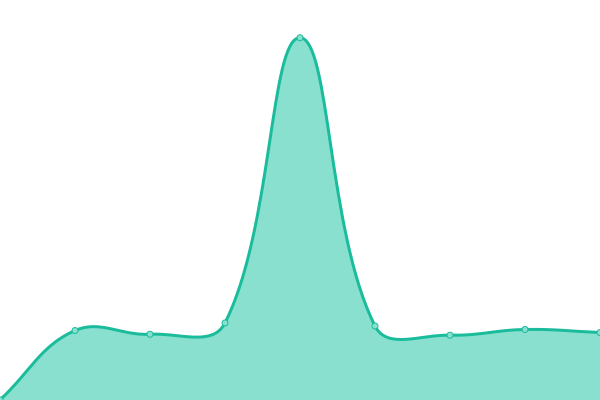

# [📈 Live Status](https://aau-network-security.github.io/uptime-haaukins): <!--live status--> **🟩 All systems operational**

This repository contains the open-source uptime monitor and status page for [Network Security](http://es.aau.dk), powered by [Upptime](https://github.com/upptime/upptime).

With [Upptime](https://upptime.js.org), you can get your own unlimited and free uptime monitor and status page, powered entirely by a GitHub repository. We use [Issues](https://github.com/aau-network-security/uptime-haaukins/issues) as incident reports, [Actions](https://github.com/aau-network-security/uptime-haaukins/actions) as uptime monitors, and [Pages](https://aau-network-security.github.io/uptime-haaukins) for the status page.

<!--start: status pages-->
<!-- This summary is generated by Upptime (https://github.com/upptime/upptime) -->
<!-- Do not edit this manually, your changes will be overwritten -->

| URL                                                   | Status | History                                                                                                                         | Response Time                                                                           | Uptime                                                                                                                                                                                                                                              |
| ----------------------------------------------------- | ------ | ------------------------------------------------------------------------------------------------------------------------------- | --------------------------------------------------------------------------------------- | --------------------------------------------------------------------------------------------------------------------------------------------------------------------------------------------------------------------------------------------------- |
| [General Haaukins](https://general.haaukins.com)      | 🟩 Up  | [general-haaukins.yml](https://github.com/aau-network-security/haaukins-uptime/commits/master/history/general-haaukins.yml)     |  734ms   |       |
| [Admin Haaukins](https://admin.haaukins.com:8003)     | 🟩 Up  | [admin-haaukins.yml](https://github.com/aau-network-security/haaukins-uptime/commits/master/history/admin-haaukins.yml)         |  496ms     |          |
| [Beta Haaukins](https://beta.ntp-event.dk)            | 🟩 Up  | [beta-haaukins.yml](https://github.com/aau-network-security/haaukins-uptime/commits/master/history/beta-haaukins.yml)           |  378ms      |             |
| [Admin Dev Haaukins](https://admin.ntp-event.dk:8003) | 🟩 Up  | [admin-dev-haaukins.yml](https://github.com/aau-network-security/haaukins-uptime/commits/master/history/admin-dev-haaukins.yml) |  581ms |  |

<!--end: status pages-->

[**Visit our status website →**](https://aau-network-security.github.io/uptime-haaukins)

## 📄 License

- Code: [MIT](./LICENSE) © [Network Security](http://es.aau.dk)
- Data in the `./history` directory: [Open Database License](https://opendatacommons.org/licenses/odbl/1-0/)
